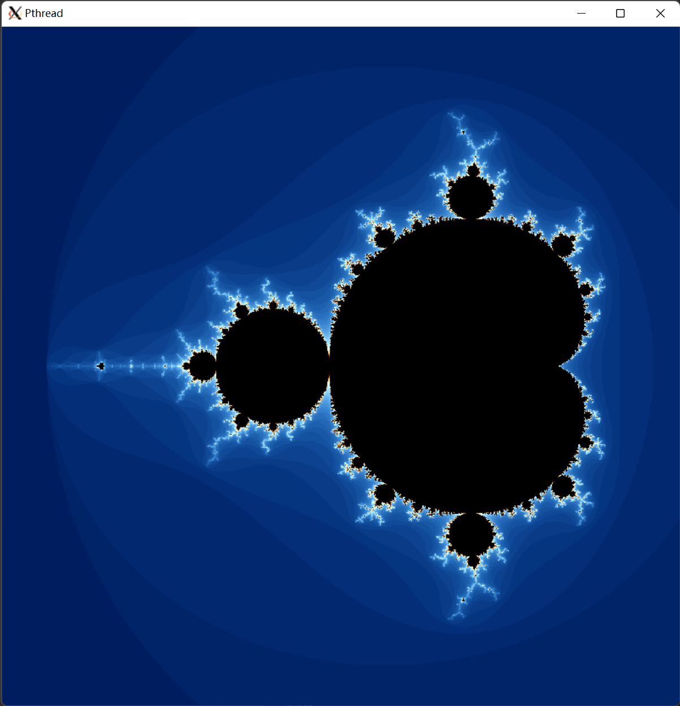

# Mandelbrot Set Computation

Parallel implementaion of Mandelbrot Set Computation (MPI, Pthread)

## Objective

Compute if a sample point $c\in\mathbb{C}$ is in Mandelbrot set, i.e., check if $z_n = z_{n-1}^2 + c; z_0 =  0$ is not diverging to infinity.

## GUI demo

<!--  -->

    

*the palette in colorization is adopted from [here](https://iquilezles.org/articles/palettes/)*

## Code Usage

See "Appendix A" of `doc/report.pdf`