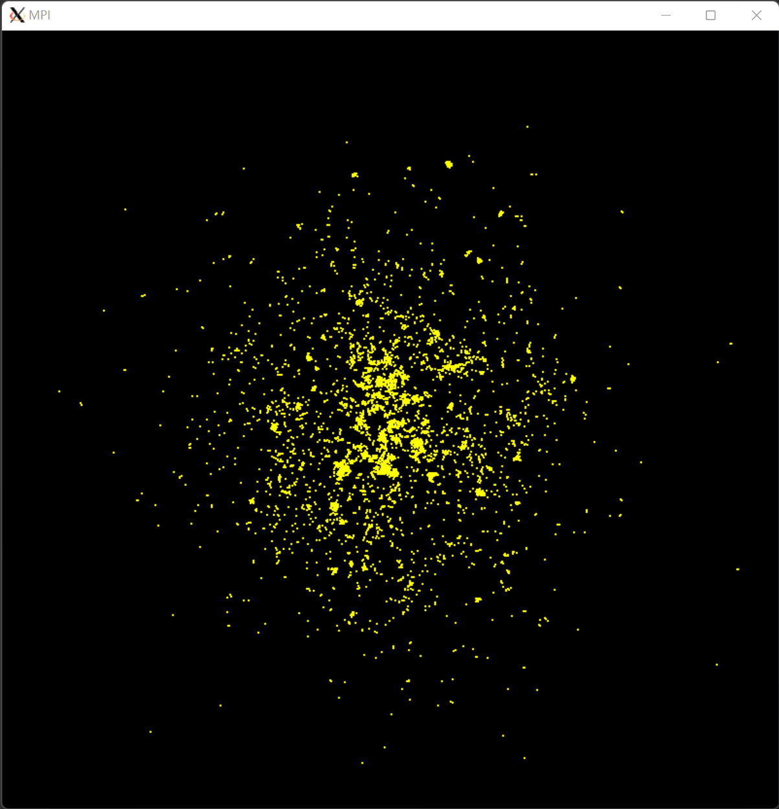
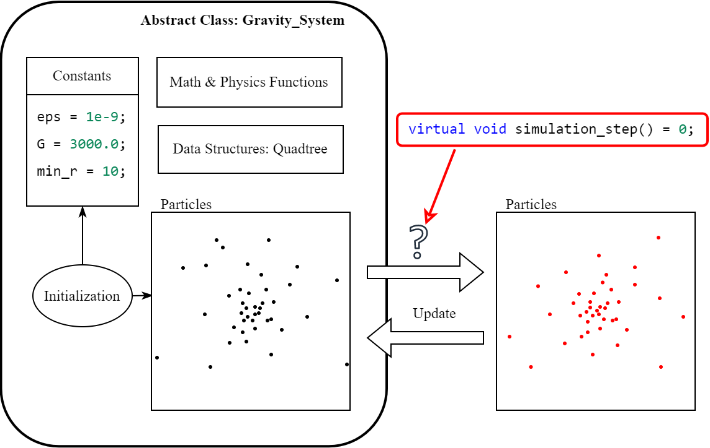
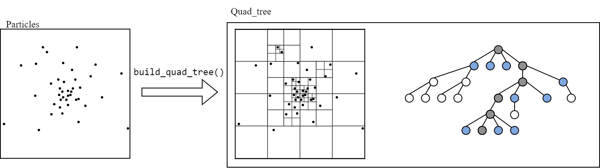

# N-body Simulation

Simulation on 2d N-body problem in parallel (MPI, Pthread, OpenMP, CUDA, and MPI+OpenMP hybrid method)

## Objective

Simulate the 2d N-body motion by integrating on discrete time sample, where gravitational force and elastic collision are the only concerned reactions between particles. 

## Basic simulation method

Regular numerical integral methods leads to quick divergence of the result. This project adopt leapfrog integration:
$$
x_{i+1} = x_i + v_i \Delta t + \frac{1}{2}a_i \Delta t^2 \\
v_{i+1} = v_i + \frac{1}{2}(a_i + a_{i+1})\Delta t
$$
whose error is about $2^{\text{nd}}$ order to the time step, which is enough for this project. And is easier to implement than methods with more accuracy (e.g., the Runge–Kutta method)

## GUI demo

<!--  -->

    

## Code Framework

<!--  -->

    

## Barnes-Hut Simulation

This project adopts Barnes-Hut's method to simluate N-body problem with Quad-tree data structure, which simulate the problem in $O(N)$ times for 1 step, where $N$ is the number of particles (the brute-force method takes $O(N^2)$ times). Unfortunately, parallizing algorithm with such efficiency 
suffers from great commmunication overhead.

## Code Usage:

See "Appendix A" in `doc/report.pdf`