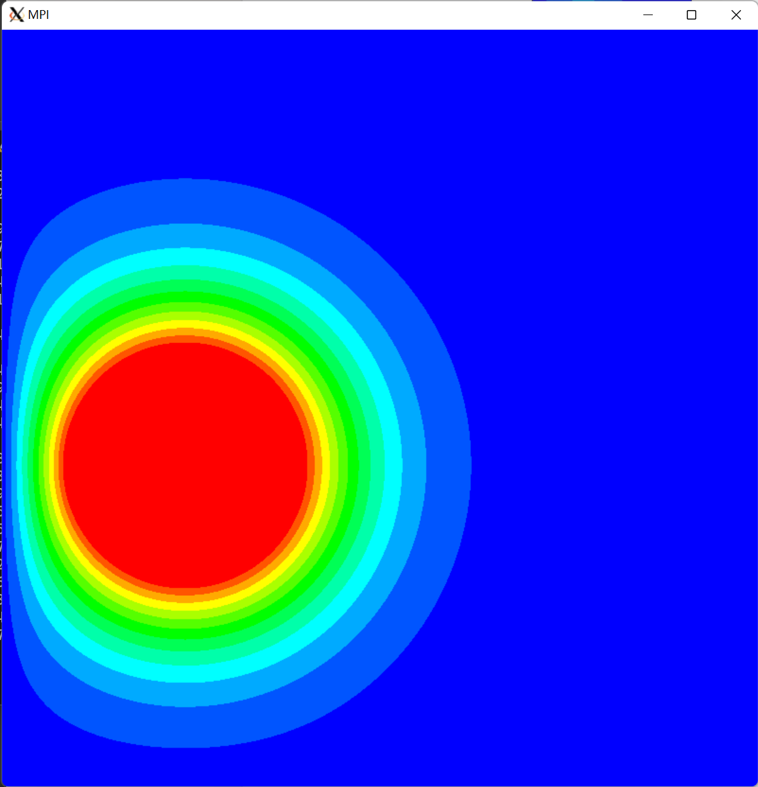

# Heat-Distribution Simulation

Parallelizing Jacobbi integration in computing heat-distribution simulation (MPI, Pthread, OpenMP, CUDA, and MPI+OpenMP hybrid method).

## GUI demo

<!--  -->

    

<!--  -->

## Code Usage

See "Appendix A" in `doc/report.pdf`

